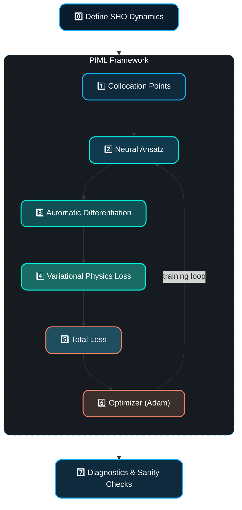

# Project 1 Architecture

```mermaid
%%====================================================================
%%  CURVED-CORNER MERMAID WITH SUBGRAPH HEADER
%%====================================================================
%%{ init: {
        "theme": "base",
        "themeVariables": {
            "background": "#0d1117",
            "lineColor": "#14b5ff",
            "textColor": "whitesmoke",
            "fontFamily": "'Aclonica', sans-serif",
            "borderRadius": "16"       /* larger radius for more rounded corners */
        },
        "handDrawn": true
    } }%%
%%====================================================================

flowchart TB

    %%--------------------------------------------------------------
    %%  COLOR RAMP (pseudo-gradient)
    %%--------------------------------------------------------------
    classDef stage0 fill:#0b1c2d,stroke:#14b5ff,stroke-width:2px,color:#ffffff,rx:12,ry:12;
    classDef stage1 fill:#0f2a3d,stroke:#14b5ff,stroke-width:2px,color:#ffffff,rx:12,ry:12;
    classDef stage2 fill:#103b4f,stroke:#00f5db,stroke-width:2px,color:#ffffff,rx:12,ry:12;
    classDef stage3 fill:#124f55,stroke:#00f5db,stroke-width:2px,color:#ffffff,rx:12,ry:12;
    classDef stage4 fill:#1a6b63,stroke:#00f5db,stroke-width:2px,color:#ffffff,rx:12,ry:12;
    classDef stage5 fill:#1f4e5f,stroke:#f78166,stroke-width:2px,color:#ffffff,rx:12,ry:12;
    classDef stage6 fill:#3a2f2a,stroke:#f78166,stroke-width:2px,color:#ffffff,rx:12,ry:12;
    classDef stage7 fill:#0f2a3d,stroke:#14b5ff,stroke-width:2px,color:#ffffff,rx:12,ry:12;

    classDef dashed fill:#161b22,stroke:#14b5ff,stroke-dasharray:6 6,color:#ffffff,rx:12,ry:12;

    %%--------------------------------------------------------------
    %%  MAIN PIPELINE SUBGRAPH WITH HEADER
    %%--------------------------------------------------------------
    subgraph PIML["PIML Framework"]
        direction TB
        B["1️⃣ Collocation Points"]:::stage1
        C["2️⃣ Neural Ansatz"]:::stage2
        D["3️⃣ Automatic Differentiation"]:::stage3
        E["4️⃣ Variational Physics Loss"]:::stage4
        F["5️⃣ Total Loss"]:::stage5
        G["6️⃣ Optimizer (Adam)"]:::stage6

        B --> C
        C --> D
        D --> E
        E --> F
        F --> G
        G -- training loop --> C
    end

    %%--------------------------------------------------------------
    %%  CONTEXT & DIAGNOSTICS
    %%--------------------------------------------------------------
    A["0️⃣ Define SHO Dynamics"]:::stage0
    H["7️⃣ Diagnostics & Sanity Checks"]:::stage7

    A --> PIML:::dashed
    PIML --> H
    
    click C "assets/phase_space.png" "View figure"
```