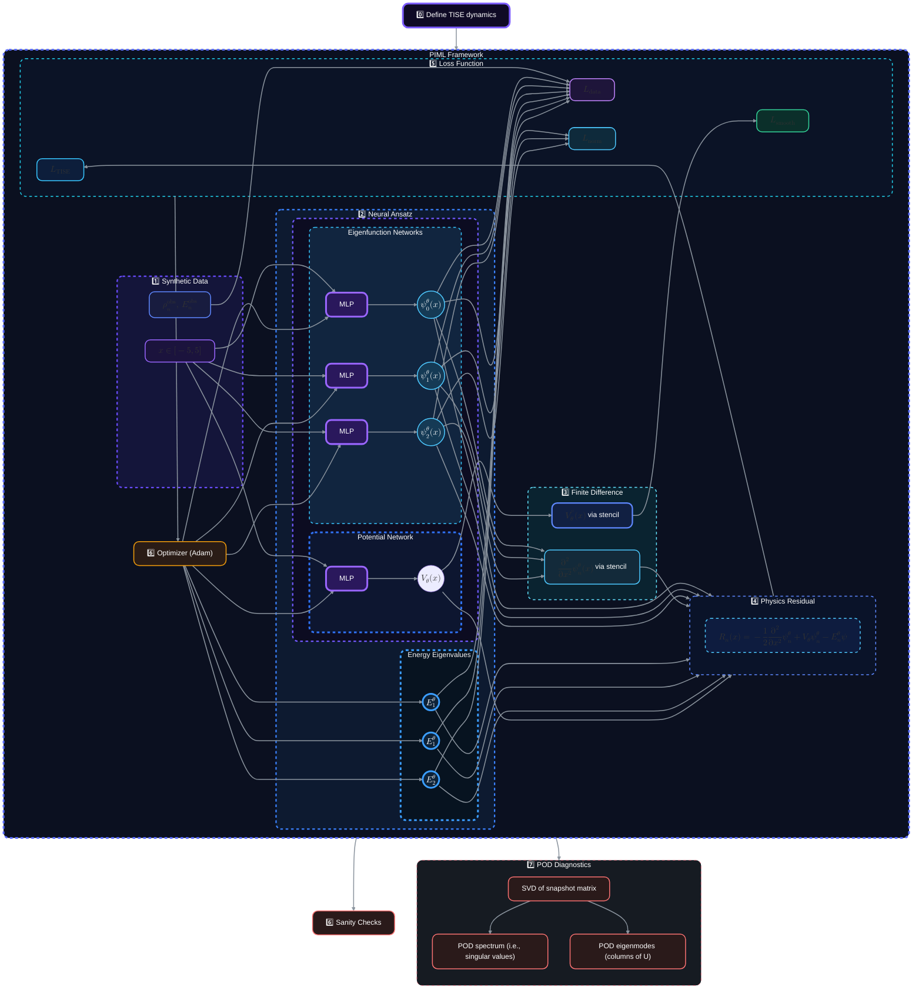

# Architecture

```mermaid
%%====================================================================
%%  2️⃣ Project 2 Architecture
%%====================================================================
%%{ init: {
        "theme": "base",
        "themeVariables": {
            "background": "#060817",
            "lineColor": "#14B5FF",
            "textColor": "whitesmoke",
            "fontFamily": "'Aclonica', sans-serif",
            "borderRadius": "16"
        },
        "handDrawn": true,
        "displayMode": "compact"
    }
}%%
%%====================================================================
flowchart TB

    %%-----------------------------------------------------------
    %%  NODE DEFINITIONS
    %%-----------------------------------------------------------
    step0["0️⃣ Define TISE dynamics"]

    MLP1["MLP"]:::MLP
    MLP2["MLP"]:::MLP
    MLP3["MLP"]:::MLP
    MLP4["MLP"]:::MLP

    potential(("$$V_\theta(x)$$"))
    wavefunction_0(("$$\psi_0^\theta(x)$$")):::eigenfunctions
    wavefunction_1(("$$\psi_1^\theta(x)$$")):::eigenfunctions
    wavefunction_2(("$$\psi_2^\theta(x)$$")):::eigenfunctions

    %%-----------------------------------------------------------
    %% CORE PIPELINE (PIML Framework)
    %%--------------------------------------------------------------
    subgraph PIML["PIML Framework"]
    direction LR

        subgraph synthetic["1️⃣ Synthetic Data"]
        direction TB
            spatial_grid["$$x\in[-5,5]$$"]:::spatial
            observed_data["$$\rho_n^\text{obs}, \, E_n^\text{obs} $$"]
        end

        subgraph learned_parameters["2️⃣ Neural Ansatz"]
        direction TB
            subgraph PINN[" "]
            direction TB

                subgraph potential_network["Potential Network"]
                direction LR
                    MLP1 --> potential
                end

                subgraph eigenfunction_networks["Eigenfunction Networks"]
                direction TB
                    MLP2 --> wavefunction_0
                    MLP3 --> wavefunction_1
                    MLP4 --> wavefunction_2
                end

            end

            subgraph energy_eigenvalues["Energy Eigenvalues"]
            direction LR
                energy_0(("$$E_1^\theta$$")):::energy
                energy_1(("$$E_1^\theta$$")):::energy
                energy_2(("$$E_2^\theta$$")):::energy
            end
        end

        learned_parameters:::PINN

        spatial_grid --> MLP1
        spatial_grid --> MLP2
        spatial_grid --> MLP3
        spatial_grid --> MLP4

        subgraph finite_difference["3️⃣ Finite Difference"]
        direction LR
            potential_stencil["$$V_\theta''(x)\,$$ via stencil"]
            eigenfunction_stencil["$$\frac{\partial^2}{\partial x^2}\psi_n^\theta(x) \,$$via stencil"]
        end

        subgraph residual["4️⃣ Physics Residual"]
           A["$$R_n(x)=-\frac{1}{2}\frac{\partial^2}{\partial x^2}\psi_n^\theta + V_\theta\psi_n^\theta - E^\theta_n \psi$$"]
        end

        optimization["6️⃣ Optimizer (Adam)"]

        subgraph loss_terms["5️⃣ Loss Function"]
        direction TB
            loss_physics["$$\mathcal{L}_\text{TISE}$$"]
            loss_data["$$\mathcal{L}_\text{data}$$"]
            loss_smooth["$$\mathcal{L}_\text{smooth}$$"]
            loss_norm["$$\mathcal{L}_\text{norm}$$"]
        end
        loss_terms:::loss

        observed_data --> loss_data
        
        wavefunction_0 --> loss_data
        wavefunction_1 --> loss_data
        wavefunction_2 --> loss_data

        wavefunction_0 --> eigenfunction_stencil
        wavefunction_1 --> eigenfunction_stencil
        wavefunction_2 --> eigenfunction_stencil

        wavefunction_0 --> residual
        wavefunction_1 --> residual
        wavefunction_2 --> residual

        eigenfunction_stencil --> residual --> loss_physics

        wavefunction_0 --> loss_norm
        wavefunction_1 --> loss_norm
        wavefunction_2 --> loss_norm

        energy_0 --> loss_data
        energy_1 --> loss_data
        energy_2 --> loss_data

        energy_0 --> residual
        energy_1 --> residual
        energy_2 --> residual

        potential --> residual
        potential --> potential_stencil --> loss_smooth

        loss_terms --> optimization

        optimization --> MLP1
        optimization --> MLP2
        optimization --> MLP3
        optimization --> MLP4
        optimization --> energy_0
        optimization --> energy_1
        optimization --> energy_2

    end

    %%-----------------------------------------------------------
    %%  External connections
    %%-----------------------------------------------------------
    step0 --> PIML

    %%--------------------------------------------------------------
    %%  POST‑TRAINING DIAGNOSTICS
    %%--------------------------------------------------------------
    sanity_checks["6️⃣ Sanity Checks"]:::stage6

    subgraph POD["7️⃣ POD Diagnostics"]
        direction TB
        SVD["SVD of snapshot matrix"]:::stage6
        sigma["POD spectrum (i.e., singular values)"]:::stage6
        U["POD eigenmodes (columns of U)"]:::stage6
        %% noteW["Wᵀ holds temporal coefficients – not needed for static eigenmode analysis"]:::stage7
        %% noteSpec["‘Spectrum’ = the set of singular values; gaps signal low‑rank structure"]:::stage7

        SVD --> sigma
        SVD --> U
    end
    POD:::dashed_orange_1

    PIML --> sanity_checks
    PIML --> POD

%%-----------------------------------------------------------
%% CORE STAGES (pseudo gradient)
%%-----------------------------------------------------------

style step0 fill:#0f0a25,stroke:#7c5cff,stroke-width:4px,color:#ffffff,rx:12px, ry:12px;

style PIML fill:#0b1020,stroke:#5a6cff,stroke-width:4px,color:#ffffff,stroke-dasharray:6 6,rx:12px, ry:12px;

style synthetic fill:#14153a,stroke:#6b4cff,stroke-width:3px,color:#ffffff,stroke-dasharray:6 6,rx:12px, ry:12px;
style spatial_grid fill:#1b133d,stroke:#9a66ff,stroke-width:2px,color:#ffffff,rx:12px, ry:12px;
style observed_data fill:#181c3f,stroke:#5f88ff,stroke-width:2px,color:#ffffff,rx:12px, ry:12px;

%%-----------------------------------------------------------
%% NETWORKS
%%-----------------------------------------------------------

classDef MLP fill:#2a185c,stroke:#9a66ff,stroke-width:4px,color:#ffffff,rx:12px, ry:12px;
style eigenfunction_networks fill:#11253f,stroke:#38c6ff,stroke-width:2px,color:#ffffff,stroke-dasharray:6 6,rx:12px, ry:12px;
style learned_parameters fill:#0d1a30,stroke:#3b82ff,stroke-width:3px,color:#ffffff,stroke-dasharray:6 6,rx:12px, ry:12px;
style PINN fill:#0c0c21,stroke:#7259ff,stroke-width:3px,color:#ffffff,stroke-dasharray:6 6,rx:12px, ry:12px;

classDef eigenfunctions fill:#153a55,stroke:#4ec9ff,stroke-width:2px,color:#ffffff,rx:12px, ry:12px;

classDef potential fill:#11163a,stroke:#5f88ff,stroke-width:4px,color:#ffffff,rx:12px, ry:12px;
style potential_network fill:#0d1630,stroke:#3072f5,stroke-width:4px,color:#ffffff,stroke-dasharray:6 6,rx:12px, ry:12px;

classDef energy fill:#0d2238,stroke:#3b9eff,stroke-width:4px,color:#ffffff,rx:12px, ry:12px;
style energy_eigenvalues fill:#071320,stroke:#3b9eff,stroke-width:4px,color:whitesmoke,stroke-dasharray: 6 6, rx:12px, ry:12px;

%%-----------------------------------------------------------
%% PHYSICS OPERATORS
%%-----------------------------------------------------------

style finite_difference fill:#0a2330,stroke:#63e2ff,stroke-width:2px,color:#ffffff,stroke-dasharray: 6 6,rx:12px, ry:12px;
style potential_stencil fill:#112042,stroke:#5f88ff,stroke-width:3px,color:#ffffff,rx:12px, ry:12px;
style eigenfunction_stencil fill:#132a3a,stroke:#4ec9ff,stroke-width:2px,color:#ffffff,rx:12px, ry:12px;

style residual fill:#0a1329,stroke:#5f88ff,stroke-width:2px,color:#ffffff,stroke-dasharray:6 6,rx:12px, ry:12px;
style A fill:#0e1c3f,stroke:#4ec9ff,stroke-width:2px,color:#ffffff,stroke-dasharray:6 6,rx:12px, ry:12px;

%%-----------------------------------------------------------
%% LOSS (cyan end of gradient)
%%-----------------------------------------------------------

classDef loss fill:#0a0f1a,stroke:#22d3ee,stroke-width:2px,color:#ffffff,stroke-dasharray:6 6,rx:12px, ry:12px;
style loss_terms fill:#0b1326,stroke:#22d3ee,stroke-width:2px,color:#ffffff,stroke-dasharray:6 6,rx:12px, ry:12px;

style loss_physics fill:#0d1e3b,stroke:#38c6ff,stroke-width:2px,color:#ffffff,rx:12px, ry:12px;
style loss_norm fill:#0e2a3b,stroke:#4ec9ff,stroke-width:2px,color:#ffffff,rx:12px, ry:12px;
style loss_smooth fill:#0b2f2a,stroke:#34d399,stroke-width:2px,color:#ffffff,rx:12px, ry:12px;
style loss_data fill:#1e153a,stroke:#c084fc,stroke-width:2px,color:#ffffff,rx:12px, ry:12px;

%%-----------------------------------------------------------
%% OPTIMIZER (accent color)
%%-----------------------------------------------------------

style optimization fill:#2a1c16,stroke:#f59e0b,stroke-width:2px,color:#ffffff,rx:12px, ry:12px;

%%-----------------------------------------------------------
%% POST-TRAINING DIAGNOSTICS
%%-----------------------------------------------------------

classDef stage6 fill:#2a1a1a,stroke:#f87171,stroke-width:2px,color:#ffffff,rx:12px, ry:12px;
classDef stage7 fill:#2a1a1a,stroke:#fb7185,stroke-width:2px,color:#ffffff,rx:12px, ry:12px;

classDef dashed_orange_1 fill:#161b22,stroke:#fb7185,stroke-dasharray:6 6,color:#ffffff,rx:12px, ry:12px;

%%-----------------------------------------------------------
%% LINKS
%%-----------------------------------------------------------

linkStyle default stroke:#8b949e,stroke-width:2px;
```